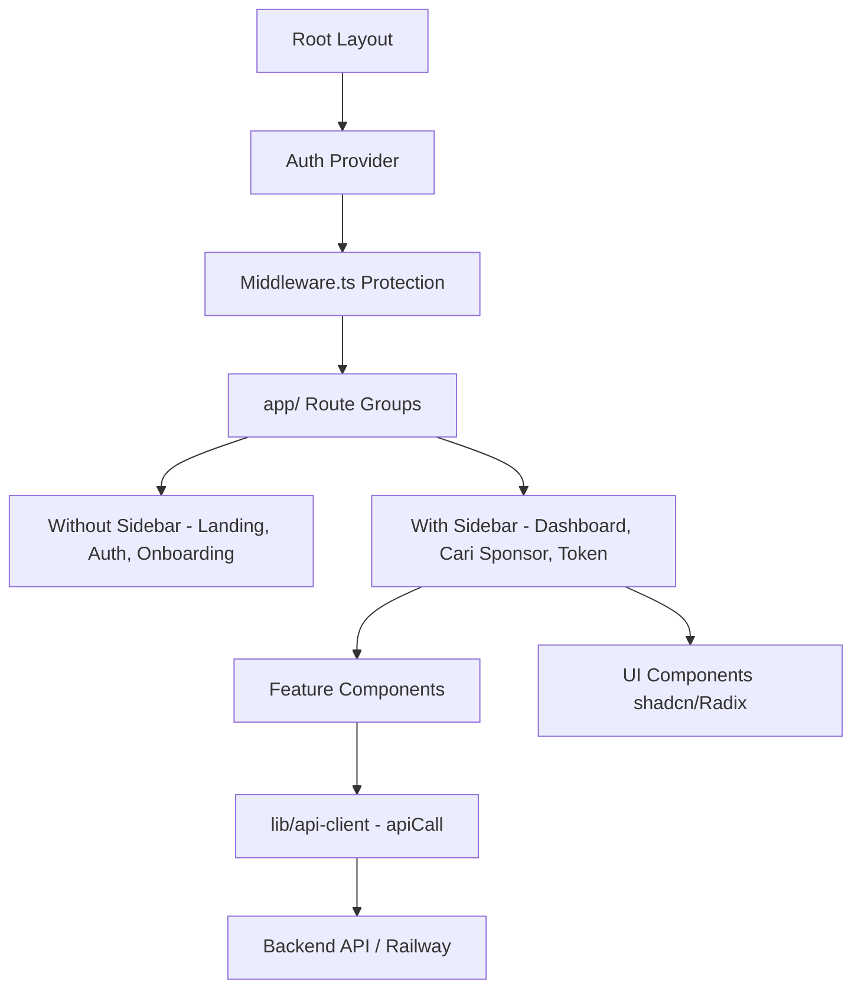

# EventHub Frontend

EventHub adalah platform modern berbasis web yang dirancang untuk menghubungkan Event Organizer (EO) dengan sponsor secara cerdas dan efisien. Repositori ini berisi kode sumber frontend EventHub yang dibangun dengan teknologi terdepan untuk menghadirkan performa maksimal, aksesibilitas tinggi, dan pengalaman pengguna (UX) yang sangat premium.

---

## Tech Stack yang Digunakan

EventHub Frontend memanfaatkan ekosistem modern React dan Next.js untuk menyajikan aplikasi web berkinerja tinggi, responsif, dan mudah dipelihara.

### 1. Core Framework & Language

- **Next.js 16.2.3 (App Router)**: Framework utama berbasis React yang mendukung server-side rendering (SSR), static site generation (SSG), optimalisasi gambar otomatis, dan routing dinamis berbasis file yang sangat terstruktur.
- **React 19.2.4**: Library inti untuk membangun User Interface (UI) berbasis komponen yang interaktif dan deklaratif.
- **TypeScript 5**: Memberikan keamanan pengetikan data (_type safety_) statis yang meminimalkan bug runtime dan mempermudah proses refactoring berskala besar.

### 2. Styling, Desain & Animasi

- **Tailwind CSS v4 & PostCSS**: Framework utility-first CSS generasi terbaru yang menawarkan performa kompilasi instan dan fleksibilitas tanpa batas dalam merancang desain premium yang responsif.
- **Framer Motion 12.38.0**: Library animasi andalan untuk mengimplementasikan transisi mikro (_micro-interactions_), animasi halaman yang mulus, dan transisi UI yang premium.
- **Lucide React**: Rangkaian ikon vektor modern, konsisten, dan berukuran ringan yang dioptimalkan untuk performa visual.

### 3. UI Component System

- **Radix UI Primitives & shadcn/ui**: Fondasi komponen UI (_headless components_) yang mematuhi standar aksesibilitas ARIA tinggi untuk pembaca layar (screen reader) dan navigasi keyboard.
- **TipTap Editor**: Editor teks kaya (_Rich Text Editor_) berbasis komponen React yang digunakan pada fitur _Proposal Builder_ untuk mempermudah EO menyusun dan memformat pitch proposal sponsorship mereka.
- **Sonner**: Sistem notifikasi toast yang responsif, minimalis, dan sangat estetik untuk umpan balik interaksi pengguna secara real-time.

### 4. Authentication & Storage

- **Firebase Client SDK v12.13.0**: Integrasi Firebase Auth untuk manajemen otentikasi aman melalui Email/Password serta OAuth Google Sign-In.
- **Next.js Middleware**: Digunakan untuk validasi otentikasi di level edge/network guna melindungi rute halaman (_route protection_) secara dinamis.

---

## Arsitektur Frontend

Arsitektur kode frontend EventHub dirancang menggunakan pola terstruktur yang modular, memisahkan logika bisnis, manajemen state, dan komponen visual secara rapi.



### 1. Struktur Rute (Route Groups)

Untuk menyederhanakan manajemen layout, rute dibagi menjadi dua kelompok utama di bawah direktori `app/`:

- `app/(without sidebar)/`: Halaman publik dan alur otentikasi awal di mana sidebar tidak ditampilkan (contoh: Landing Page, Login, Register, dan alur Multi-step Onboarding).
- `app/(with sidebar)/`: Rute terproteksi yang menampilkan tata letak dashboard interaktif lengkap dengan sidebar navigasi khusus berdasarkan peran pengguna:
  - `app/(with sidebar)/(eo)/`: Berisi rute spesifik untuk Event Organizer seperti pembuatan event (`buat-event`), pencarian sponsor (`cari-sponsor`), dan manajemen proposal.

### 2. Organisasi Komponen (Component Layering)

Komponen frontend dibagi secara modular ke dalam dua tingkat utama:

- `components/ui/`: Komponen murni (_presentational components_) yang sangat reusable dan diimpor langsung dari pustaka shadcn/ui (misalnya tombol, kartu, input dialog, dropdown select).
- `components/`: Komponen pintar (_container/feature-based components_) yang memiliki state internal dan logika interaksi dengan API, diorganisasikan berdasarkan fitur terkait (misalnya `components/cari-sponsor/`, `components/dashboard/`).

### 3. Otentikasi & Rute Terproteksi

- **Auth Provider (`providers/auth-provider.tsx`)**: Menyediakan global state untuk memantau status sesi Firebase Auth (`authLoading`, `isAuthenticated`, `currentUser`). Sesi pengguna didelegasikan ke Firebase token cookie (`firebaseToken`) agar dapat divalidasi langsung di sisi server.
- **Middleware (`middleware.ts`)**: Bertindak sebagai penjaga gerbang rute. Rute sensitif seperti `/dashboard`, `/buat-event`, atau `/token-management` akan langsung dialihkan ke `/login` jika token otentikasi tidak terdeteksi.

### 4. API Client & Komunikasi Data (`lib/api-client.ts`)

Seluruh komunikasi data ke backend dipusatkan pada pembungkus (_wrapper_) kustom `apiCall`. Utilitas ini secara otomatis menangani:

- Injeksi JSON header dan metode request (`GET`, `POST`, `PATCH`, `DELETE`).
- Pengambilan otomatis JWT Firebase ID Token pengguna aktif untuk disisipkan sebagai header `Authorization: Bearer <token>`.
- Standardisasi penanganan error jaringan maupun error respon dari backend API.

### 5. Hydration & Local Storage Drafting

Halaman _Multi-step Onboarding_ mengimplementasikan sistem penyimpanan draf otomatis (_local draft autosave_) ke `localStorage` berdasarkan ID pengguna Firebase (`uid`). Fitur ini dirancang dengan pengaman `isHydrated` untuk menghindari perbedaan struktur render (_hydration mismatch_) antara server-side pre-rendering Next.js dan render client-side.

---

## 📂 Struktur Direktori Proyek

Berikut adalah peta struktur folder dan berkas utama dari EventHub Frontend:

```
eventhub/
├── app/                           # Struktur Rute Next.js App Router
│   ├── (with sidebar)/            # Rute Terproteksi dengan Sidebar Layout
│   │   ├── (company)/             # Halaman khusus Perusahaan (Sponsor)
│   │   ├── (eo)/                  # Halaman khusus Event Organizer (EO)
│   │   │   ├── buat-event/        # Form pengajuan kustom event & proposal
│   │   │   ├── cari-sponsor/      # Matchmaking AI & daftar tawaran sponsor masuk
│   │   │   ├── katalog-event-eo/  # Daftar event milik EO aktif
│   │   │   └── proposal-smart-rev/ # Smart Review AI untuk proposal sponsor
│   │   ├── dashboard/             # Dashboard ringkasan status utama
│   │   ├── pengaturan/            # Pengaturan profil, instansi & akun
│   │   ├── pesan/                 # Fitur chat/messaging interaktif EO & Company
│   │   ├── token-management/      # Top-up token sponsorship via Midtrans Snap
│   │   └── layout.tsx             # Tata letak sidebar navigasi utama
│   ├── (without sidebar)/         # Rute Publik & Onboarding (Tanpa Sidebar)
│   │   ├── bantuan/               # Pusat bantuan & FAQ pengguna
│   │   ├── katalog-event/         # Direktori publik pencarian event sponsor
│   │   ├── login/                 # Form masuk Firebase Authentication
│   │   ├── onboarding/            # Form multi-langkah pembuatan profil awal
│   │   ├── proposal-builder/      # AI Proposal Builder (Rich Text Editor)
│   │   ├── register/              # Form pendaftaran akun baru
│   │   └── page.tsx               # Landing Page utama EventHub
│   ├── globals.css                # Konfigurasi Tailwind CSS global
│   └── layout.tsx                 # Root Layout HTML & Fonts global
├── components/                    # Komponen React Modular & Reusable
│   ├── ui/                        # Komponen visual dasar (shadcn/ui & Radix UI)
│   ├── buat-event/                # Sub-komponen multi-step buat event
│   ├── cari-sponsor/              # Gated-contact & penawaran detail
│   ├── dashboard/                 # Grafik statistik & visual dashboard
│   ├── landing/                   # Komponen visual khusus landing page
│   ├── onboarding/                # Visual navbar & step onboarding
│   ├── proposal-builder/          # Modul editor proposal teks kaya
│   ├── sidebar-eo.tsx             # Sidebar navigasi khusus Event Organizer
│   ├── sidebar-company.tsx        # Sidebar navigasi khusus Perusahaan (Sponsor)
│   └── footer.tsx                 # Footer responsif global
├── hooks/                         # React Custom Hooks
├── lib/                           # Konfigurasi Utilitas & API Client
│   ├── api-client.ts              # API client wrapper apiCall dengan JWT header
│   ├── firebase.ts                # Kredensial & inisialisasi Firebase Auth SDK
│   └── utils.ts                   # Utilitas styling dengan tailwind-merge
├── providers/                     # React Context State Providers
│   └── auth-provider.tsx          # Global Context Sesi Firebase Auth
├── public/                        # Aset Statis (Logo, Gambar, Favicon)
├── middleware.ts                  # Protektor rute berbasis cookie token
└── README.md                      # Dokumentasi Proyek Utama
```

---

## Cara Menjalankan Project Secara Lokal

Ikuti langkah-langkah di bawah ini untuk memulai pengembangan frontend EventHub di lingkungan lokal Anda:

### Prerequisites

Pastikan Anda sudah menginstal **Node.js** (versi 18 ke atas) dan paket manajer **pnpm** (atau npm/yarn).

### Langkah-langkah:

1.  **Clone Repositori**:

    ```bash
    git clone <repository-url>
    cd eventhub
    ```

2.  **Instalasi Dependencies**:

    ```bash
    pnpm install
    ```

3.  **Konfigurasi Environment Variables**:
    Buat file bernama `.env.local` di direktori root proyek dan isi dengan kredensial Firebase serta URL API Backend Anda:

    ```env
    NEXT_PUBLIC_FIREBASE_API_KEY=your_api_key
    NEXT_PUBLIC_FIREBASE_AUTH_DOMAIN=your_auth_domain
    NEXT_PUBLIC_FIREBASE_PROJECT_ID=your_project_id
    NEXT_PUBLIC_FIREBASE_STORAGE_BUCKET=your_storage_bucket
    NEXT_PUBLIC_FIREBASE_MESSAGING_SENDER_ID=your_sender_id
    NEXT_PUBLIC_FIREBASE_APP_ID=your_app_id
    NEXT_PUBLIC_API_BASE_URL=your_backend_api_url
    NEXT_PUBLIC_MIDTRANS_CLIENT_KEY=your_midtrans_client_key
    ```

4.  **Jalankan Server Pengembangan**:

    ```bash
    pnpm dev
    ```

    Buka browser Anda dan akses **[http://localhost:3000](http://localhost:3000)**.

5.  **Build untuk Produksi**:
    Untuk memverifikasi kebersihan kode TypeScript dan membuat bundle build siap produksi:
    ```bash
    pnpm build
    ```

---
